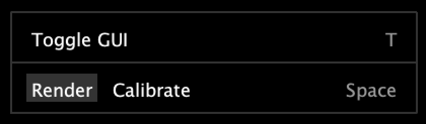
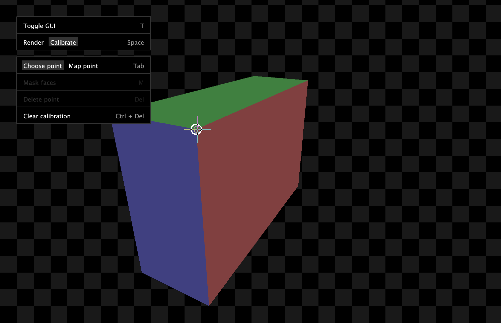

# Getting started

## Installation

### Manual installation

1. Ensure you have the latest version of [Processing](https://processing.org/) installed on your computer.
1. Navigate to Shape Mapper's [Releases page](https://github.com/alexdmiller/shape-mapper/releases).
1. Download the `shapemapper.pdex` file for the most recent release.
1. Open the file to automatically install the library.

### Install via Contributions Manager

Installing via the Contributions Manager is not yet currently available.

## Code

In order to use Shape Mapper, you must have a physical object that you want to projection map, and you must model that object virtually (whether through code or through 3D modeling software like [Blender](https://www.blender.org/)).

To get started quickly, we can use a box-shaped object. In this example, we'll be using a cardboard box, but a book or boxy piece of furniture could also work.

[picture of box]

1.  In order to model our box in code, we'll need to measure the size of the physical box. Our box is [measurements].
1.  Create a new Processing sketch and import the Shape Mapper library, as well as the Processing [PShape](https://processing.org/tutorials/pshape) class:

    ```
    import spacefiller.shapemapper.ShapeMapper;
    import processing.core.PShape;
    ```

1.  Create two top level variables to store the Shape Mapper library object and the shape that we'll be mapping:

    ```
    ShapeMapper mapper;
    PShape shape;
    ```

1.  Write a setup function that initializes the shape and the Shape Mapper library. When initializing the screen size, it is recommended to use [`fullScreen()`](https://processing.org/reference/fullScreen_.html). It is required to use the [`P3D` render mode](https://processing.org/tutorials/p3d); Shape Mapper will not work without it.

    ``` java
    void setup() {
        fullScreen(P3D);

        // The size of our box is proportional to the physical measurements we made
        shape = createShape(BOX, 100, 200, 300);

        // Initialize the Shape Mapper library with our box
        mapper = new ShapeMapper(this, shape);
    }
    ```

1.  Next, we'll write a simple draw function that renders an outline of the box. To map our rendered geometry to the physical box, we'll need to sandwich the drawing code within the `mapper.beginMapping()` and `mapper.endMapping()` lines.

    ``` java
    void draw() {
        background(0);
        
        mapper.beginMapping();
        
        // Disable the default shape style so that we can choose fill and stroke
        // manually in the code
        shape.disableStyle();
        
        // Draw the shape
        fill(0);
        stroke(255);
        shape(shape);
        
        mapper.endMapping();
    }
    ```

1.  Putting it all together, our sketch should look like this:

    ``` java
    import spacefiller.shapemapper.ShapeMapper;
    import processing.core.PShape;

    ShapeMapper mapper;
    PShape shape;

    void setup() {
        fullScreen(P3D);
        shape = createShape(BOX, 100, 200, 300);
        mapper = new ShapeMapper(this, shape);
    }

    void draw() {
        background(0);
        
        mapper.beginMapping();
        
        // Disable the default shape style so that we can choose fill and stroke
        // manually in the code
        shape.disableStyle();
        
        // Draw the shape
        fill(0);
        stroke(255);
        shape(shape);
        
        mapper.endMapping();
    }
    ```

## Calibration

Now that we have the code for the sketch set up, we can calibrate our mapping.

1.  Connect your computer to a projector and point the projector at the object you're mapping.
1.  Run the sketch you wrote above. By default, the Shape Mapper GUI will appear in the upper left hand portion of the screen. (Note: you can hide this GUI by hitting `T`, or in the code using `mapper.hideGui()`.)

    

1.  Hit `Space` to switch from `Render` mode to `Calibrate` mode. This will reveal the calibration GUI.

    

2.  Your 3D model will appear in the center of the screen. We must now select a point to calibrate from this 3D model. You can navigate the model with the following controls:
    1.  Click + drag to orbit
    2.  Command + click + drag to pan
    3.  Scroll to zoom in and out
3.  Click a point on your model to select it. We will now map this point to the corresponding point on the physical object.
4.  Hit `Tab` to switch to mapping mode.
5.  Look at your object in physical space and move your mouse so that the crosshairs are centered on the corresponding vertex of the physical object. Click to create a point in the projected space.

    TODO: image

6.  Hit `Tab` to switch back to point selection. Choose another point and repeat the process.
7.  After mapping 6 points, a full calibration will be automatically estimated. Press `Space` so switch back to `Render` mode. In physical space, your object should now be successfully mapped.

    TODO: image

## Tips & tricks

- If your model does not accurately represent your physical object, then the mapping will be misaligned.
- You can adjust mapped points after placing them to tune your calibration.
- You can add more than 6 points to refine your mapping.
- To remove a point, click to select it and press `Delete`.
- To completely clear all calibrations, press `Ctrl + Delete`.

## Creating animations

Shape Mapper does not offer any animation or visual effect functionality; that is up for you to create with Processing code! One quick way to animate your mapped object is to use [`pointLight(...)`](https://processing.org/reference/pointLight_.html):

``` java
void draw() {
    background(0);
    mapper.beginMapping();

    // Add two rotating point lights to color the faces
    pointLight(
        255, 0, 0,
        sin(frameCount / 10f) * 400,
        cos(frameCount / 10f) * 400,
        sin(frameCount / 10f) * 400);
    pointLight(
        0, 0, 255,
        cos(frameCount / 10f) * 400,
        sin(frameCount / 10f) * 400,
        sin(frameCount / 10f) * 400);

    shape(shape);
    mapper.endMapping();
}
```

TODO: image