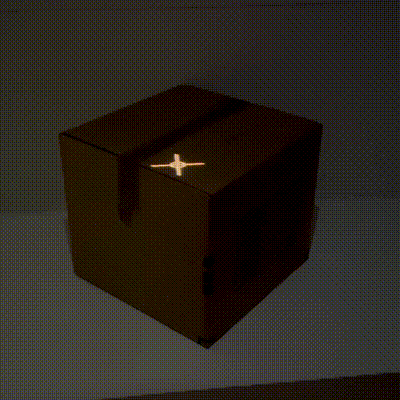

# How-to: Use multiple projectors

If you want to projection map a physical object from more than one angle, you'll need to use two or more projectors. Shape Mapper supports calibrating more than one projector.

## Hardware considerations

If you can connect multiple projectors to your computer directly, great! If not, you'll need a video wall controller like [this one](https://www.amazon.com/gp/product/B0949RH44N/ref=ppx_yo_dt_b_search_asin_title?ie=UTF8&psc=1).

## Write the Processing sketch

Starting from the code in the [Getting Started tutorial](tutorial-getting-started.md), we need to make a couple of modifications.

1.  In addition to importing the main `ShapeMapper` class, you'll also need to import two other classes:

    ``` java
    import spacefiller.shapemapper.ShapeMapper;
    import spacefiller.shapemapper.MappedShape;
    import spacefiller.shapemapper.Mapping;
    ```

2.  We'll need to store a reference to a [MappedShape](/shape-mapper/javadoc/spacefiller/shapemapper/MappedShape.html) in the top level of our sketch.

    ``` java
    MappedShape mappedShape;
    ```

3.  Modify the setup function to add a shape with the [`addShape(...)`](https://alexdmiller.github.io/shape-mapper/javadoc/spacefiller/shapemapper/ShapeMapper.html#addShape(java.lang.String,processing.core.PShape,int)) method.

    ``` java
    myShape = createShape(BOX, 150);
    mapper = new ShapeMapper(this);
    mappedShape = mapper.addShape("box", myShape, 2);
    ```

    This alternate way of initializing your shape has two important differences:

    1.  The third parameter of `addShape()` specifies the number of mappings you would like to initialize, which corresponds to the number of projectors you have.
    2.  `addShape()` returns a `MappedShape`, which you can store for use in your `draw()` function.

4.  Now modify the draw function with this code:

    ``` java
    for (Mapping mapping : mappedShape.getMappings()) {
      mapping.beginMapping();
      shape(myShape);
      mapping.endMapping();
    }
    ```

    This will loop through the list of mappings and draws a separate perspective for each projector.

5.  Putting it all together:

    ``` java
    import spacefiller.shapemapper.ShapeMapper;
    import spacefiller.shapemapper.MappedShape;
    import spacefiller.shapemapper.Mapping;

    ShapeMapper mapper;
    PShape myShape;
    MappedShape mappedShape;

    void setup() {
      fullScreen(P3D);
      myShape = createShape(BOX, 150);
      mapper = new ShapeMapper(this);
      mappedShape = mapper.addShape("box", myShape, 2);
    }

    void draw() {
      background(0);  

      for (Mapping mapping : mappedShape.getMappings()) {
        mapping.beginMapping();
        shape(myShape);
        mapping.endMapping();
      }
    }
    ```

## Calibrate the projection mapping

1.  Run the sketch.
2.  Hit `Space` to switch from `Render` mode to `Calibrate` mode.
3.  Click a point on your model to select it.
4.  Hit `Tab` to switch to mapping mode.
5.  Look at your object in physical space and move your mouse so that the crosshairs are centered on the corresponding vertex of the physical object. Click to create a point in the projected space.

    

6.  Hit `Tab` to switch back to point selection. Choose another point and repeat the process.
7.  After mapping 6 points, a full calibration will be automatically estimated.
8.  Now press `Right →` to switch to the next mapping.
9.  Repeat steps 3-7 on your second projector.

## Face masking

If you have a face of your physical object which both projectors are mapping, you can mask out the face on one of the mappings to avoid drawing it twice.

1.  Face masking requires that your geometry be structured in a specific way. Your top level `PShape` must be a parent of child `PShape`s which represent the faces. If you export an `.obj` file from Blender and import it into Processing, this is the default representation.
2.  Once you have calibrated your mappings, switch to face masking mode.
    1.  Press `Space` to switch to `Calibrate` mode.
    2.  Press `M` to enable `Mask faces`.
3.  Press `← Left` or `Right →` to choose the mapping you want to mask.
4.  Click a face to toggle it on or off.

    

5.  Now press `Space` to switch back to `Render` mode. The faces you have selected should be masked out.
