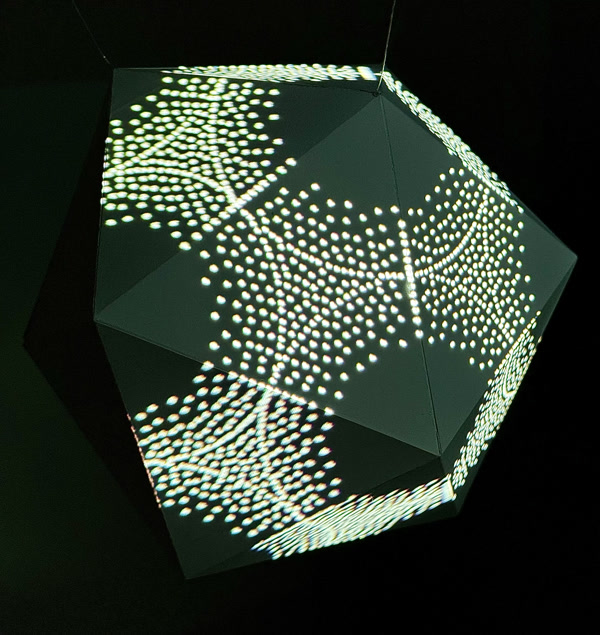
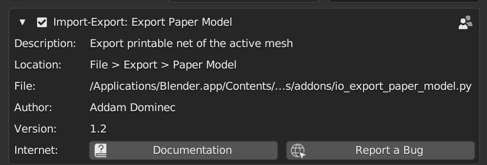
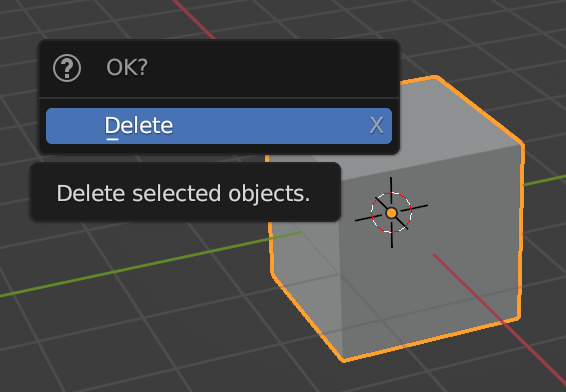
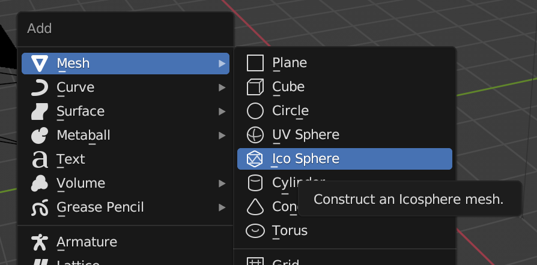
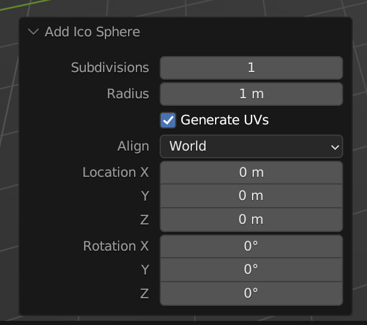
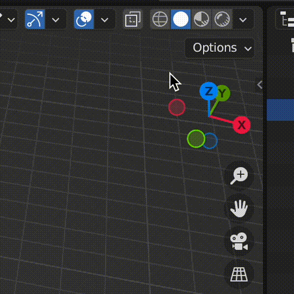
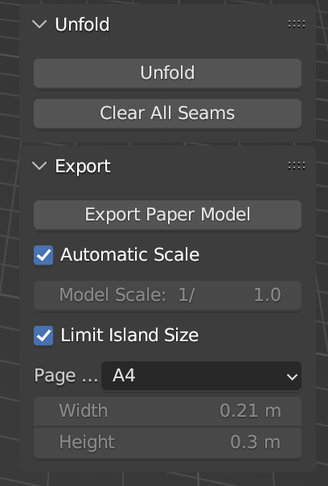
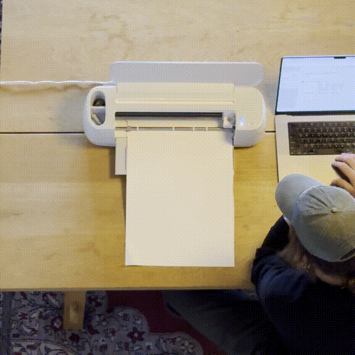

# Tutorial: Map a paper-folded object



Shape Mapper lends itself well to projection mapping objects fabricated from digital models. There are many ways to fabricate such a model, but paper craft is attractive because of the low cost of materials.

In this tutorial, we'll show how to design a simple model with [Blender](https://www.blender.org/), build it using paper, and then projection map it with Shape Mapper.

Note: this tutorial assumes you have access to a printer, or even better, an automatic cutting machine such as a [Cricut](https://cricut.com/).

## Design and fabricate a model

1.  Download and install [Blender](https://www.blender.org/).
2.  Install the Export Paper Model add-on for Blender.
    1.  Within Blender, navigate to Edit > Preferences > Add-ons.
    2.  Select the "Community" tab if it is not already selected.
    3.  Search for "Export Paper Model".
    4.  Click the checkbox next to the name of the add-on to install it.
        
3.  Delete the default cube in the Blender scene by selecting it with the mouse, and then pressing `X` followed by `D`.
    
4.  Press `Shift + A` to activate the "Add" menu.
5.  Navigate to Mesh > Ico Sphere to add it to the scene.
    
6.  In the lower left hand corner, the "Add Ico Sphere" options will appear. Click these and set the subdivisions to 1.
    
7.  Adjust the size of your paper model to fit the dimensions of your paper.
    1.  Select the newly created Ico Sphere.
    2.  In the upper right hand corner of the scene view, there is a small arrow. Click this to reveal the context menu.
        
    3.  Click the "Paper" tab.
    4.  Check the "Automatic Scale" and "Limit Island Size" checkbox, and select the size of paper you're using.
        
8.  Go to File > Export > Paper Model.
    1.  If you are printing the paper model, export the model as PDF.
    2.  If you are using a cutting machine, you likely need to export as SVG to import the template to your cutting machine's software. Preparing the template for your cutting machine is outside of the scope of this tutorial.
9.  Go to File > Export > Wavefront (.obj). We'll use this file when we start writing code.
10. Print and cut out your model, or use a cutting machine to automatically cut it out.
    
11. Fold your model and adhere the tabs with glue or tape to create a 3D object.
    
    

## Write code

1.  Install Shape Mapper (see [Getting Started](tutorial-getting-started.md)).
2.  Create a Processing sketch and copy the `.obj` file you exported above into a `data/` folder in the sketch's folder.
3.  Import and initialize the Shape Mapper library, and load the `.obj` file:

    ``` java
    import spacefiller.shapemapper.ShapeMapper;

    ShapeMapper mapper;
    PShape myShape;

    void setup() {
      fullScreen(P3D);
      myShape = loadShape("icosahedron.obj");
      mapper = new ShapeMapper(this, myShape);
    }
    ```

4.  Write a draw function that renders the shape. To map our rendered geometry to the physical object, we'll need to sandwich the drawing code within the `mapper.beginMapping()` and `mapper.endMapping()` lines.

    ``` java
    void draw() {
      background(0);

      mapper.beginMapping();
      noLights();
      pointLight(
        0,
        255,
        255,
        sin(frameCount / 10f) * 500,
        cos(frameCount / 10f) * 500,
        sin(frameCount / 10f) * 500);  
      noStroke();
      shape(myShape);
      mapper.endMapping();
    }
    ```
## Calibrate the projection mapping

Now that we have the code for the sketch set up, we can calibrate our mapping.

1.  Connect your computer to a projector and point the projector at the object.
2.  Run the sketch. The Shape Mapper GUI will appear in the upper left hand portion of the screen. (Note: you can hide this GUI by hitting `T`, or in the code using `mapper.hideGui()`.)
3.  Hit `Space` to switch from `Render` mode to `Calibrate` mode. This will reveal the calibration GUI.

    

4.  Your 3D model will appear in the center of the screen. You can navigate the model with the following controls:
    1.  Click + drag to orbit
    2.  Command + click + drag to pan
    3.  Scroll to zoom in and out
5.  Click a point on your model to select it.
6.  Hit `Tab` to switch to mapping mode.
7.  Look at your object in physical space and move your mouse so that the crosshairs are centered on the corresponding vertex of the physical object. Click to create a point in the projected space.
8.  Hit `Tab` to switch back to point selection. Choose another point and repeat the process.
9.  After mapping 6 points, a full calibration will be automatically estimated. Press `Space` so switch back to `Render` mode. In physical space, your object should now be successfully mapped.

    
